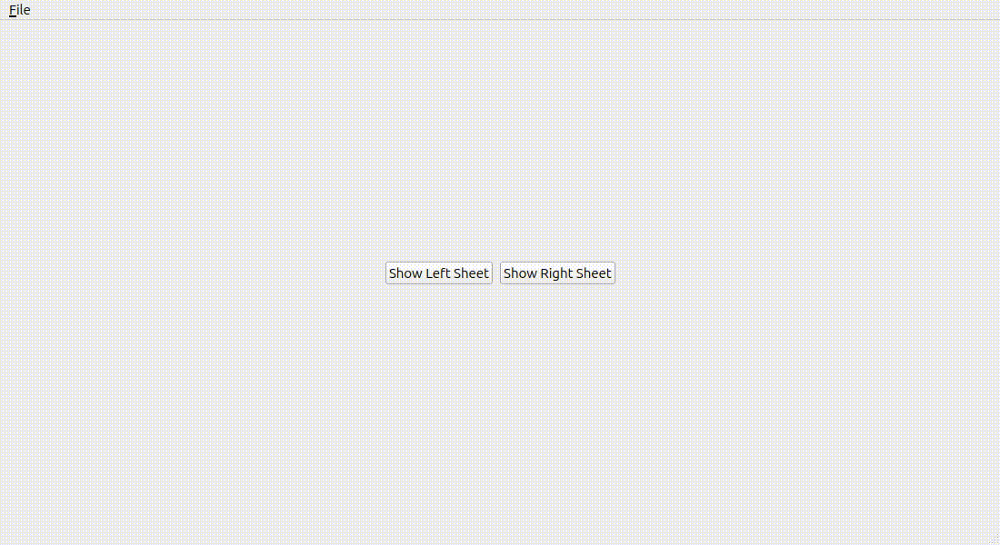

# QtSheet



- [QtSheet](#qtsheet)
  - [Introduction](#introduction)
  - [Features](#features)
  - [Installation](#installation)
  - [Usage](#usage)
  - [License](#license)
[](http://www.wtfpl.net/about/)

## Introduction

QtSheet is a simple and easy-to-use library for creating a sliding sheet in Qt.

## Features

QtSheet provides a simple animated sliding sheet that can be used in any Qt application. The sheet can be used to display additional information or options to the user. The sheet's content is a just QWidget and completely up to you.

## Installation

In the spirit of Shadcn (A web component framework), just copy the ```qtsheet.h``` and ```qtsheet.cpp``` files into your project and use the sheet.

## Usage

```cpp
#include "qtsheet.h"

MainWindow::MainWindow(QWidget *parent) {
    /* ... */

    // setup the sheet's content
    m_sheetContent = new QWidget(this);
    auto sheetLayout = new QVBoxLayout(m_sheetContent);
    auto header = new QLabel(this);
    header->setText(R"(<html>
        <h2>About QtEmpty</h2>
        <p>Qt Empty is an example project for qt.
        The branch features Tablemodels, Popup-Menus
        and the sliding sidepanel.
        </p>)");
    header->setWordWrap(true);
    sheetLayout->setContentsMargins(9, 0, 13, 0);
    sheetLayout->addWidget(header);
    sheetLayout->addStretch();

    // add another close button to the sheet
    auto sheetButton = new QPushButton("Close", this);
    connect(sheetButton, &QPushButton::clicked, this, [this] {
        this->m_sheetPanel->hideSheet();
    });
    sheetLayout->addWidget(sheetButton, 0, Qt::AlignRight);

    // create the sheet panel
    m_sheet = new Sheet(m_sheetContent, this);

    // add a button to open the sheet
    auto sheetButton = new QPushButton("Open Sheet", this);
    connect(sheetButton, &QPushButton::clicked, this, [this] {
        this->m_sheet->showSheet(this,  Sheet::Side::Right);
    });    

    /* ... */
}
```

### Compiling the example

To compile the example using cmake into a folder called `build`, you can use the following command:

```bash
# first create a build directory
cmake -S . -B build
# then compile the example
cmake --build build
# to clean up the build directory
cmake --build build --target clean

# to run the example
./build/qtsheet
```

If this does not work, delete the build directory and start over but set the `CMAKE_PREFIX_PATH` to the Qt installation directory. Set it to a Qt-Version and Compiler. For example:

```bash
cmake -S . -B build -DCMAKE_PREFIX_PATH=/path/to/Qt/6.8.2/gcc_64
```

## The Image of the Example

The image shown in the example is not covered by the License of qtsheet, but is provided by Pexels. You can find the image [here](https://www.pexels.com/photo/white-printer-paper-590011/).


## License

QtSheet is written by Stepan Rutz and released under the WTFPL License. It comes with no warranty and as-is.
The WTFPL License is provided as a file in this source-tree and is very permissive (to say the least).

